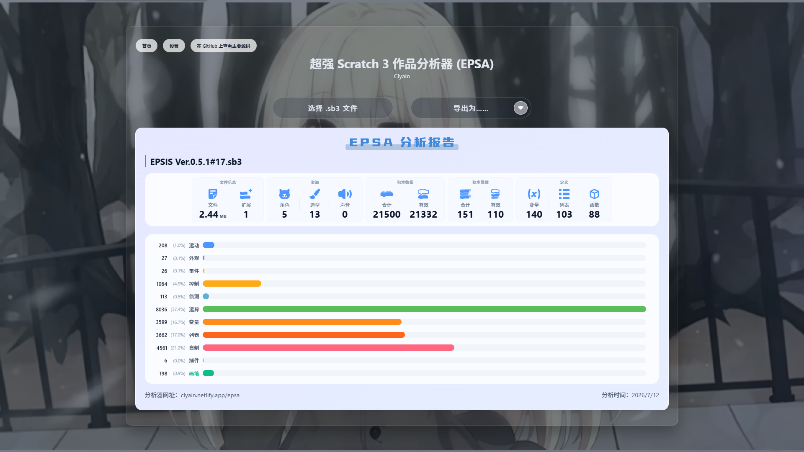

# Scratch 3 Project Analyzer

[简体中文](README.md) | English

It can analyze Scratch 3 projects and obtain information about the number of blocks, internal extension source code and extension information (TurboWarp), sprites, costumes, sounds, variables, lists and functions, etc.

---

## Website

Check out the visual page and more features at [Scratch Project Analyzer](https://clyain.netlify.app/scratchanalyzer/).

</img>

*Note: The source code of this page is only a part of this website and does not have as many features.*

---

## Using it on Your Website

#### Preparation

If you want to reference it, please introduce the author's information in a prominent place.

Download the resources in the folder `Analyzing for Scratch 3 Projects`， of course, except for `index.html`, (but it can provide you with some reference).

Just like `index.html`:
Then, you need to reference these JavaScript files in your project, like this:

```html
<script src="main.js"></script>
<script src="LoadExtensionsSource.js"></script>
<script src="GetExtensionsInfo.js"></script>
<script src="Stats.js"></script>
```

> Note:
> The line in `index.html` that implements file upload is:
>
> ```html
> <input type="file" id="fileInput" accept=".sb3">
> ```
>
> The line in `main.js` that implements event listening is:
>
> ```javascript
> document.getElementById('fileInput').addEventListener('change', function (e) {
>    const file = e.target.files[0];  // 获取选中的第一个文件
>    if (!file) return;
>    // ...
> });
> ```

#### How to Get the Values

In the `main.js` file, you need to find these lines of code near the end:

```javascript
// 完成
// 完成
// 完成
```

All statistical tasks have been completed here. You can then obtain information about the project through the following code:

1.  Get the total number of blocks: `stats.BlocksNum`;
2.  Get the number of valid blocks: `stats.TrueBlocksNum`;
3.  Total number of block stacks: `stats.PilesNum`;
4.  Number of valid block stacks: `stats.TruePilesNum`;
5.  Number of function definitions: `stats.FuncDefinitions`;
6.  Number of variable definitions: `variableCount()`;
7.  Number of list definitions: `listCount()`;
8.  Number of costumes: `costumeCount()`;
9.  Number of sounds: `soundCount()`;
10. File size (in MB): `fileSizeMB`;
11. The `project.json` file inside the project: `ProjectData`;
12. Extensions used by the project: `ProjectExtensions`;
13. Number of blocks in different categories: `BlocksNumInType`;
14. Number of blocks using extensions: `ExtBlocksNumInType`.
